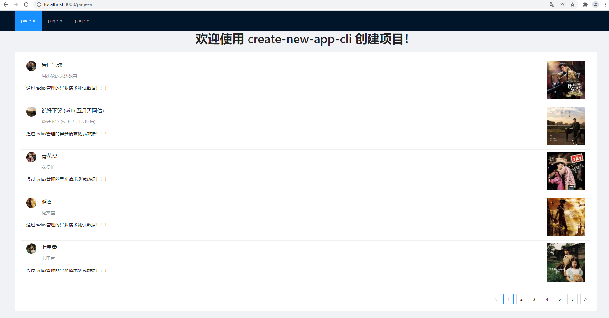
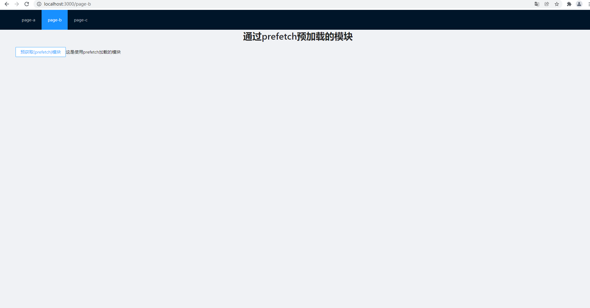
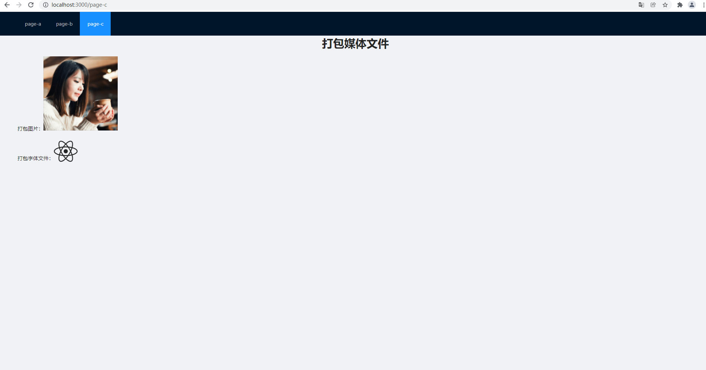

# react-app-template
React based basic template application

当前创建的项目已经默认配置了如下信息：

+ 从0到1使用 webpack 实现的项目打包配置信息

+ 使用 react-router 管理的三个页面

+ 使用 react-redux 管理数据

+ axios 异步请求（通过 redux-thunk 实现 redux 对异步请求的管理）

+ antd 组件库

*> demo 运行成功后的三个页面：*

*>*

*> page-a：通过react-redux，redux-thunk管理的请求的测试数据展示列表*

*>*

*> page-b：测试对于prefetch预获取的模块打包*

*>*

*> page-c：测试媒体文件的打包*

 页面截图：

 

 

 